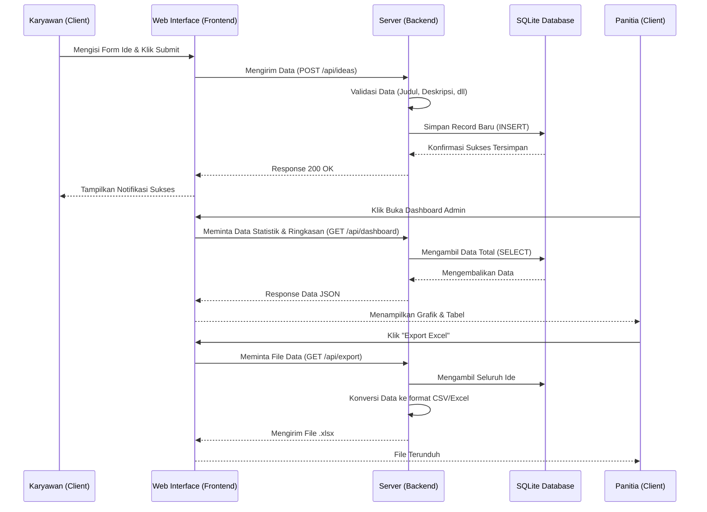
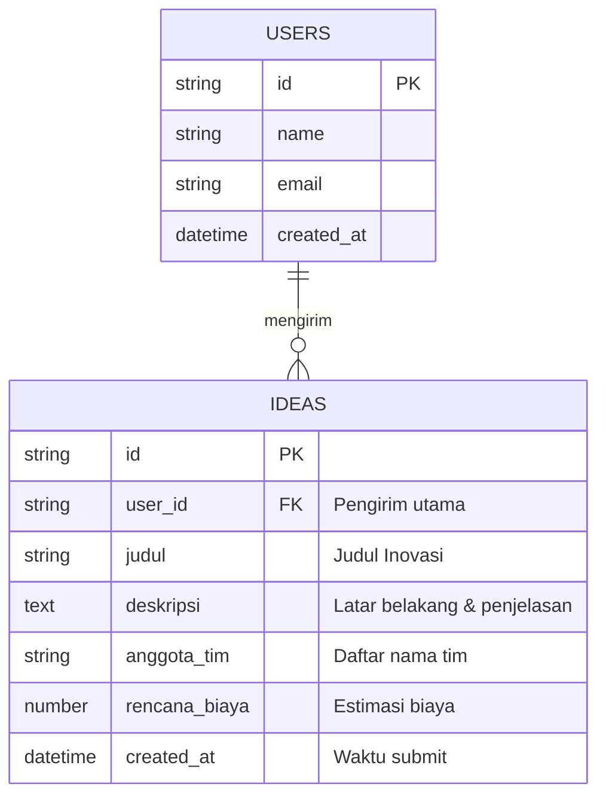

# PRD — Project Requirements Document

## 1. Overview
UP Muara Karang akan menyelenggarakan event **IGNITE (IDEA GENERATION FOR FUTURE ELECTRICITY) TAHUN 2025**, sebuah lomba inovasi internal. Saat ini, dibutuhkan sebuah wadah digital tersentralisasi untuk menampung *brainstorming* dan ide-ide unik dari seluruh karyawan. 

Tujuan utama dari aplikasi ini adalah mempermudah karyawan dalam mengirimkan ide mereka tanpa hambatan teknis, sekaligus memberikan kemudahan bagi panitia penyelenggara untuk memantau statistik masuknya ide dan mengekspor data tersebut (misalnya ke format Excel) untuk keperluan penilaian lebih lanjut.

## 2. Requirements
- **Target Pengguna:** Seluruh Karyawan UP Muara Karang.
- **Waktu Pengerjaan:** 1 bulan (membutuhkan solusi yang cepat dikembangkan dan langsung bisa digunakan).
- **Akses & Visibilitas:** Bersifat "Publik" (internal perusahaan), di mana setiap karyawan dapat dengan mudah mengakses aplikasi.
- **Tanpa Alur Persetujuan (Approval):** Ide yang dikirimkan akan langsung tersimpan dan tercatat di database tanpa perlu proses *screening* bertingkat di dalam aplikasi.
- **Reporting:** Membutuhkan *dashboard* analitik sederhana dan kemampuan penarikan data mentah.

## 3. Core Features
1. **Formulir Pengumpulan Ide (Submission Form):** Form sederhana yang mudah diisi melalui HP maupun Laptop. Terdiri dari input: Judul Ide, Deskripsi, Anggota Tim, dan Rencana Biaya.
2. **Galeri Ide (Idea Board):** Halaman yang menampilkan daftar ide yang sudah masuk, berfungsi untuk memicu semangat dan referensi *brainstorming* bagi karyawan lain.
3. **Dashboard Statistik (Admin/Panitia):** Halaman khusus yang menampilkan grafik sederhana seperti total ide yang masuk, tren pengumpulan ide per hari, dan rangkuman biaya.
4. **Fitur Export Excel:** Tombol sekali klik untuk mengunduh seluruh database ide ke dalam file `.xlsx` atau `.csv` agar mudah diolah oleh dewan juri.
5. **Autentikasi Sederhana:** Login/Daftar yang ringkas (bisa menggunakan email perusahaan) agar pembuat ide dapat dilacak dan divalidasi sebagai karyawan yang sah.

## 4. User Flow
**A. Perjalanan Karyawan (Pengirim Ide):**
1. Karyawan membuka link website IGNITE 2025.
2. Melakukan login sederhana.
3. Masuk ke halaman utama dan menekan tombol **"Kirim Ide Baru"**.
4. Mengisi *form* (Judul, Deskripsi, Nama-nama Anggota Tim, dan Estimasi Rencana Biaya).
5. Menekan tombol **"Submit"**. Aplikasi menampilkan pesan sukses dan ide berhasil masuk ke Galeri Ide.

**B. Perjalanan Panitia (Penyelenggara):**
1. Panitia membuka aplikasi dan masuk ke menu **"Dashboard"**.
2. Melihat statistik ide yang sudah terkumpul.
3. Mengklik tombol **"Export to Excel"** untuk mengunduh seluruh rincian ide.
4. Membuka file Excel di komputer lokal untuk membagikannya kepada dewan juri terkait.

## 5. Architecture
Aplikasi ini menggunakan arsitektur *monolith modern* di mana *Frontend* dan *Backend* berada dalam satu wadah proyek untuk mempercepat proses pembuatan (cocok untuk target 1 bulan). 

## 6. Database Schema
Karena aplikasi ditekankan pada kesederhanaan dan kecepatan pengembangan, struktur database dibuat ramping namun padat informasi.

### Penjelasan Tabel
1. **Users:** Menyimpan data karyawan yang mengakses aplikasi.
   - `id`: *Primary Key* (String/UUID)
   - `name`: Nama Karyawan (String)
   - `email`: Email Karyawan (String)
   - `created_at`: Waktu akun dibuat (Timestamp)
2. **Ideas:** Menyimpan data ide inovasi yang dikirimkan.
   - `id`: *Primary Key* (String/UUID)
   - `user_id`: *Foreign Key* merujuk ke tabel Users penghantar ide (String)
   - `judul`: Judul inovasi ide (String - Maksimal 150 karakter)
   - `deskripsi`: Penjelasan ruang lingkup dan latar belakang ide (Text)
   - `anggota_tim`: Daftar nama anggota tim, misal dipisah koma (String)
   - `rencana_biaya`: Estimasi dana yang dibutuhkan (Decimal/Number)
   - `created_at`: Waktu ide disubmit (Timestamp)

## 7. Tech Stack
Mengingat tenggat waktu yang singkat (1 bulan) dan kebutuhan pengembangan yang efisien (Fullstack), berikut adalah rekomendasi teknologi terbaik yang saling terintegrasi dengan mulus:

- **Framework (Frontend & Backend):** Next.js (App Router) — Memungkinkan pembuatan antarmuka pengguna sekaligus API di satu tempat yang sama.
- **Styling:** Tailwind CSS — Mempercepat proses desain antarmuka agar rapi dan responsif di berbagai perangkat.
- **Komponen UI:** shadcn/ui — Menyediakan komponen siap pakai (tombol, form, tabel, grafik) sehingga tidak perlu membuat desain dari nol.
- **Database:** SQLite — Database yang sangat ringan, tanpa perlu setup server terpisah, sangat cukup untuk skala internal perusahaan dan lomba.
- **ORM (Penghubung Database):** Drizzle ORM — Ringan, cepat, dan sangat bersahabat dengan TypeScript dan SQLite.
- **Authentication:** Better Auth — Sistem login modern yang sangat mudah dikonfigurasi untuk Next.js.
- **Library Export:** SheetJS atau Papaparse (dimasukkan dalam Next.js) untuk fitur konversi JSON ke Excel/CSV.
- **Deployment:** Vercel — Hosting serverless gratis atau berbiaya rendah yang terintegrasi otomatis dengan Next.js.